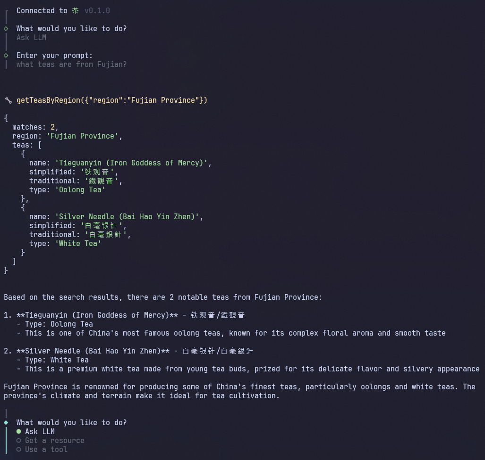

# DIY MCP

A simple from-scratch implementation of the Model Context Protocol (MCP) for building MCP servers and clients using [**stdio**](https://modelcontextprotocol.io/specification/2025-06-18/basic/transports#stdio). This example uses a simple Chinese tea collection with descriptions, origins, etc.

For production applications, check out the official [MCP SDKs](https://github.com/orgs/modelcontextprotocol/repositories).

<div align="center">
  
</div>

## Project Structure

```sh
mcp/
├── server/           # MCP server for Chinese tea information
│   └── src/
│       ├── index.ts
│       ├── stdio.ts
│       └── teas.json
└── client/           # MCP client CLI with Claude as LLM
    └── src/
        ├── index.ts
        └── llm.ts
```

## MCP Server

The core of this implementation is a lightweight MCP server. It offers the following resources and tools:

- **Resources**:
  - `tea://teas`: List of all available teas
  - `tea://teas/{slug}`: Details of a specific tea
- **Tools**:
  - `getTeasByType`: Get all teas of a specific type
  - `getTeasByRegion`: Get all teas from a specific province or region

### Setup

```sh
cd server
npm install
npm run build
```

### Running

You can test the MCP server with [MCP Inspector](https://modelcontextprotocol.io/docs/tools/inspector), an interactive tool for testing and debugging MCP servers.

```sh
cd server
npm run inspector
```

## MCP Client

You can interact with the MCP server through an MCP client like Claude Desktop, alternatively, you can use the included DIY MCP client. By adding your Anthropic API key, you can have Claude intelligently determine which tools to use based on your prompt.

The client provides three interaction modes:

- **Ask LLM**: Let Claude interact with the MCP server
- **Get a resource**: Directly access MCP server resources
- **Use a tool**: Directly call MCP server tools

### Setup

```sh
cd client
npm install
```

To use Claude, first copy the example environment file and add your Anthropic API key with available credits to the `ANTHROPIC_API_KEY` variable:

```sh
cp .env.example .env
```

### Running

The client will automatically start the MCP server, so ensure you've built it first.

```sh
cd server
npm run build
```

```sh
cd client
npm start
```

### Usage

Once running, you can interact with the MCP server through the MCP client CLI. Try asking the LLM some questions about Chinese tea:

1. "What teas do you know about?"
2. "Which teas come from Fujian?"
3. "What is your favorite green tea?"

## Resources

- [MCP Specification](https://modelcontextprotocol.io/specification/2025-06-18/basic/specification)
- [Tool use with Claude](https://docs.anthropic.com/en/docs/agents-and-tools/tool-use/overview)
